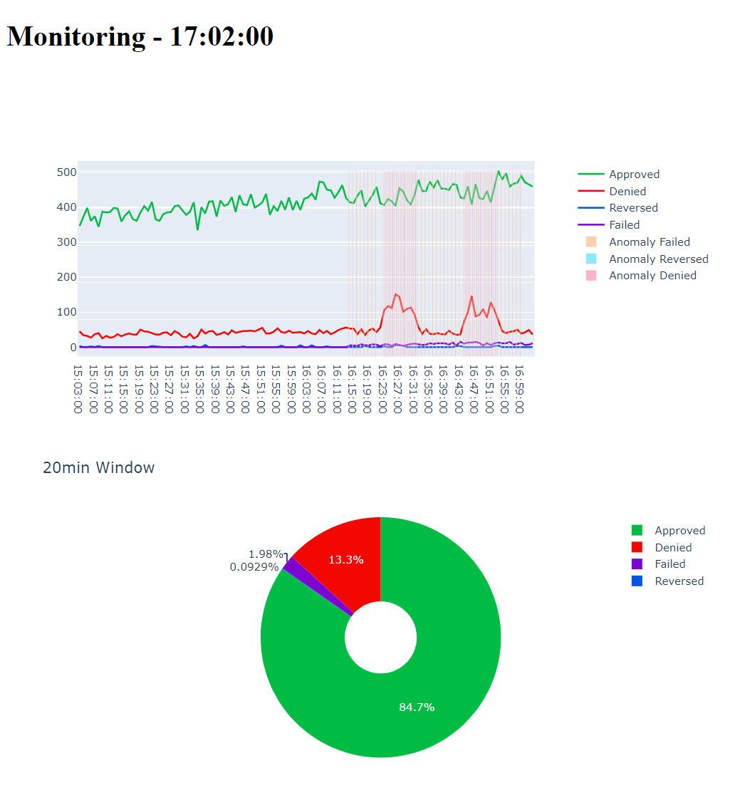

# Test Case for Cloud Walk - Monitoring Analyst

Test case focused on anomaly analysis and monitoring for the position of Business Monitoring Intelligence Analyst. The CSV files provided have data on transactions from points of sale. 
First task involves CSV files *checkout* 1 and 2, second task involves CSV files *transactions* 1 and 2.

## Task1.ipynb
 Jupyter notebook containing the entirety of task 1. The objective of this task was to analyze the checkout csv files and see if there was any anomaly in transactions, and to explain our conclusions to why these were anomalies.
 The conclusion was that sales followed a clear trend depending on the time of day. A trend which, in one particular day and time, wasn't followed. Correlations, percentage changes and line plots where indicators of the anomaly.

  The full notebook can be read by downloading **Task1.html**

## Task2.ipynb
  Jupyter notebook containing the analysis and model building for the anomaly detection asked for in task 2. Task 2 has many parts involved, and this notebook focuses only in analysing the data and building statistical models to detect such anomalies.
  Different techniques to analyze anomalies were used and different models such as Linear Regression and Isolation Forest. The live data graph and api with endpoints are in other files

  The full notebook can be read by downloading **Task2.html**

## Api.py
  Python file containig a simple Flask api that receives transaction data, transforms it and feeds it to our models for anomaly detection. The api returns the given data with 3 flags for rather there is an anomaly in Failed transactions, Reversed transactions 
  or Denied transactions. Models are saved and loaded from the *Models* folder. 

## Main.py
  Python file that loads data from *transaction_2.csv*, sends it to the Flask API to get checked for anomalies, and with the returned data runs a DASH app with live data stream of the transactions data, with 3 flags for anomaly signaling.
  The Dashboard in the Dash app has a line plot, updated with a live stream from the Flask API, with pin-point bars/lines indicating where and when anomalies have occured. **Flask API has to run first before this python file**
  

